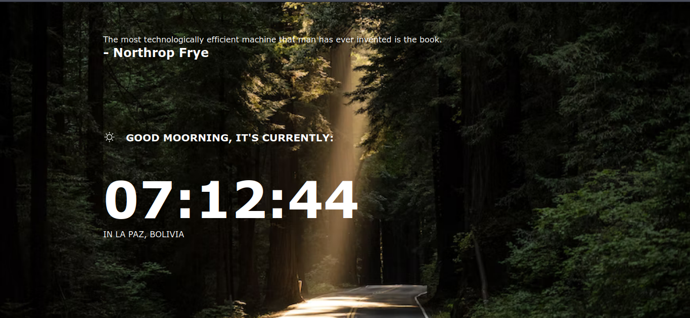

# Clock App - UMSA

This is a little project for the my college called "UMSA".

It was made in vanilla Html, Css and Javascript

## Installation

If you wanna install the whole project in your local machine, you need to
clone the project:

```shell
git clone https://github.com/freddyvelarde/freddyvelarde.github.io/
```

Then you need to install the dependences using yarn or npm even you can use pnpm if you want

```shell
# yarn
yarn

# npm
npm install

```

At the end, to up the frontend server you need to type the next one:

```shell
# yarn
yarn dev

# npm
npm dev

# pnpm
npm dev

```

And if you wanna run this also in your phone, you need to know the host:

```shell
<your package manager> dev --host

# yarn example
yarn dev --host
```

Link challenge: https://www.frontendmentor.io/challenges/clock-app-LMFaxFwrM

## Dark Desktop


## Day Desktop


