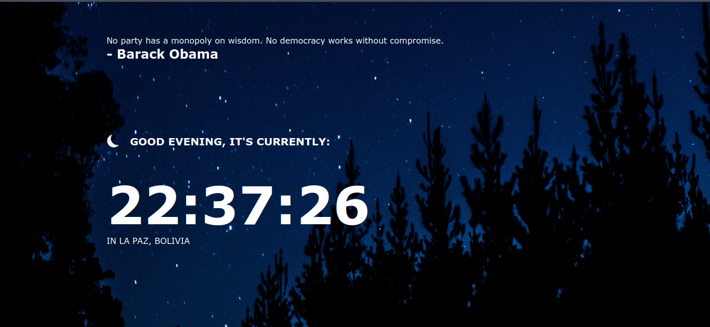

# Clock App - UMSA

## Installation

```shell
git clone https://github.com/freddyvelarde/freddyvelarde.github.io/
```

```shell
# yarn
yarn

# npm
npm install

```

Link challenge: https://www.frontendmentor.io/challenges/clock-app-LMFaxFwrM

## Dark Desktop



## Day Desktop


